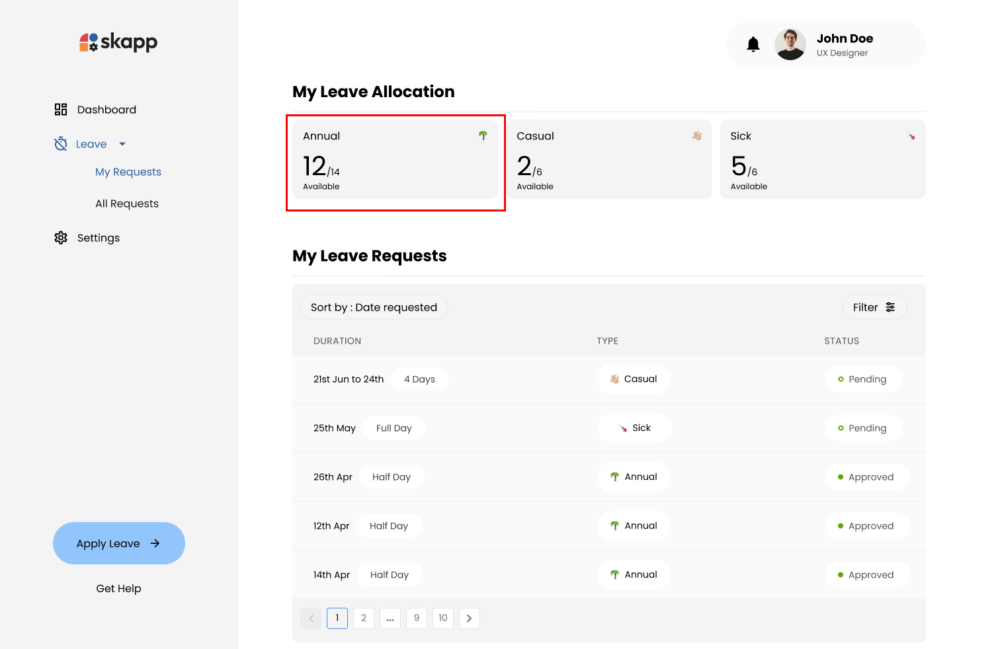
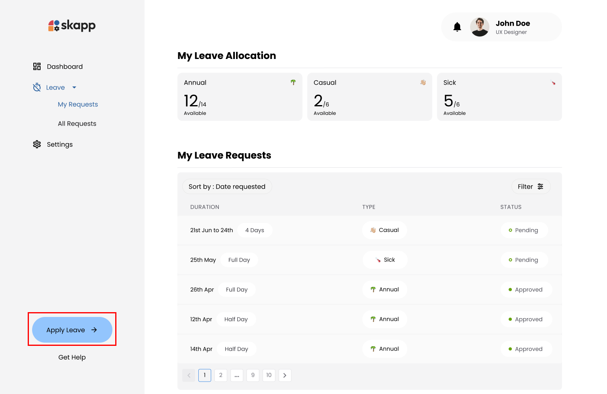
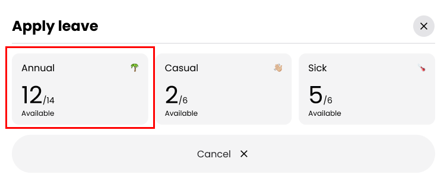
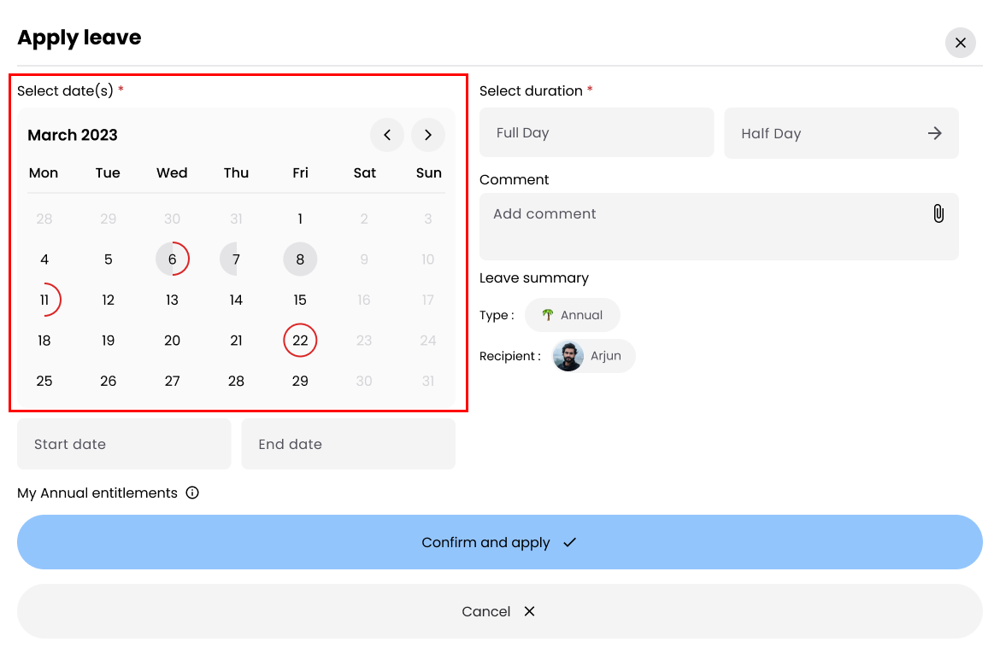
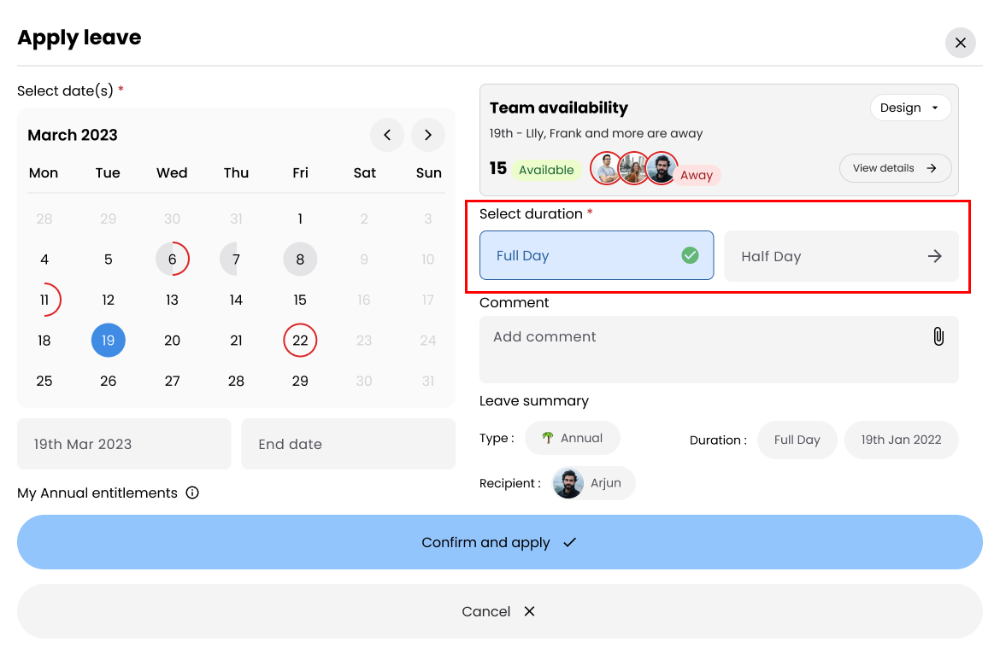
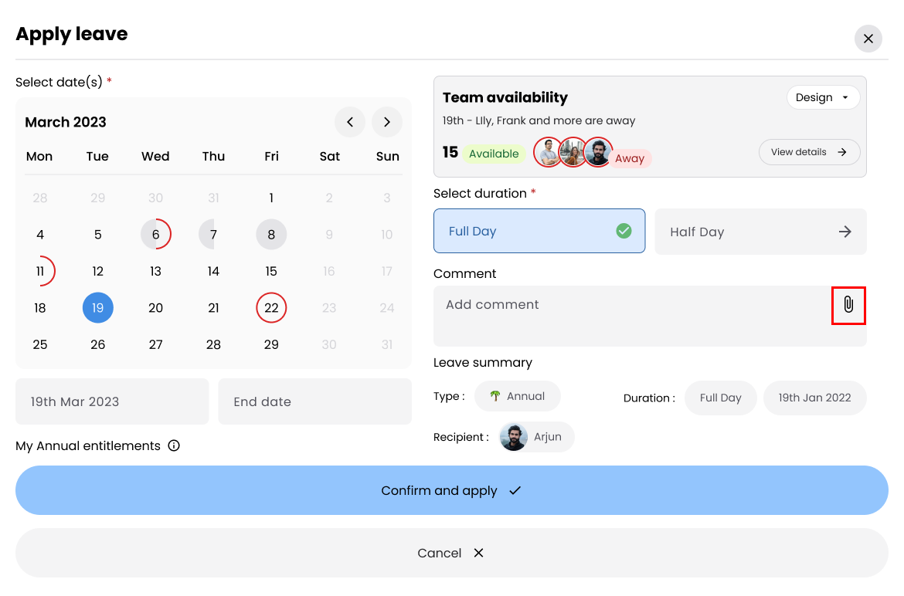
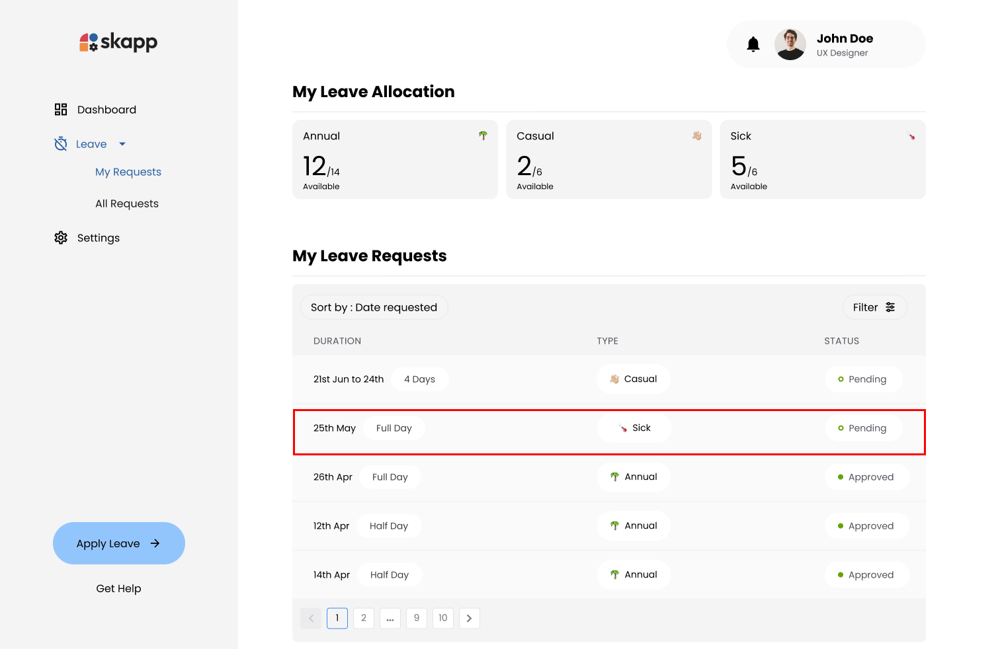
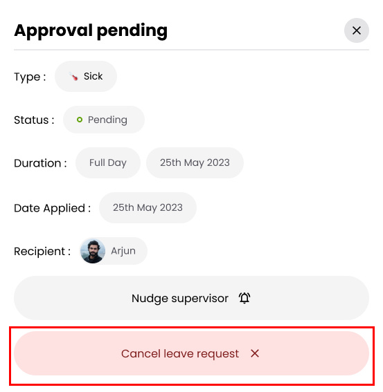
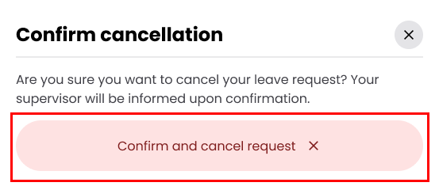

## Introduction

Managing leave allows employees to view their entitlements, apply for leave, track request statuses, and cancel pending applications when necessary. This guide provides clear instructions on using the leave management features effectively.

---

## Accessing My Requests

#### For Super Admin, Leave Admin, and Leave Manager Roles:

1. Click on the **Leave** option in the main navigation bar.
2. Click on the **My Requests** sub-menu option under the Leave module.

#### For Employee Role in All Modules:

1. On the **Dashboard**, locate the **My Requests** section upon logging in.

---

## My Leave Allocation

### View Your Leave Allocation

The **My Leave Allocation** section displays the leave types and entitlements assigned to you. Each card provides details such as:

- **Leave Type** (e.g., Annual Leave, Sick Leave).
- **Available Balance** and other relevant entitlement information.

### Carry-Forwarded Balances

- Use the **Year Dropdown** to switch to the next year.

- Balances carried to the next year appear under the entitlements for that year.

:::info
If a leave card is disabled, it may be due to one of the following reasons:

- The leave type has been fully utilized.
- The allocation period has expired.
- No supervisor has been assigned.  
   Clicking on the disabled card will display the specific reason for its status.
  :::

---

## Applying for Leave

Employees can apply for leave using **Leave Cards** or the **Apply Leave Button**.

### Step 1: Open the Apply Leave Modal

#### Option 1: From Leave Cards:

1. Click on an active leave card in the **My Leave Allocation** section.

2. This opens the **Apply Leave Modal**.

#### Option 2: From the Apply Leave Button:

1. Click the **Apply Leave** button in the navigation bar.

2. Select a leave type in the **My Allocation Modal**, which will open the **Apply Leave Modal**.

---

### Step 2: Fill Out the Leave Details

#### Select Date/s

1. Use the calendar to pick eligible working days.
2. Non-working days (e.g., weekends or company-declared holidays) are disabled.
3. Previously requested leave dates will be highlighted, and further selection will be restricted.

#### View Leave Entitlements:

1. Hover over **My (Leave Type) Entitlements** to display:
   - **Available Balance**
   - **Effective From Date**
   - **Expiry Date**

#### Check Team Availability:

1. View your team’s availability for the selected dates.
   - If you are not assigned to a team, this section will not be visible.
2. Use the **Team Selection Dropdown** to switch between teams you are assigned to.

#### Select Leave Duration:

Choose the appropriate duration for the leave request:

- **Full Day**
- **Half-day Morning**
- **Half-day Evening**

#### Add Comments (If Required):

Add a comment if your organization requires comments for the selected leave type.

#### Attach Documents (If Required):

If attachments are required:

1. Click the **Attachment Icon** to upload files.
2. Ensure the files meet the following requirements:

:::warning[File Requirements]

- **File Formats**: PDF, PNG, JPEG, JPG.
- **Size Limit**: Up to 10 MB per file; 5 files maximum.
  :::

---

### Step 3: Submit Leave Request

1. Verify all details.
2. Click **Confirm and Apply** to finalize your leave request.

---

## Viewing My Leave Requests

### Navigate to My Leave Requests

#### For Super Admin, Leave Admin, and Leave Manager Roles:

1. Click on the **Leave** option in the main navigation bar.
2. Click on the **My Requests** sub-menu option under the Leave module.
3. Scroll down to the **My Requests** section.

#### For Employees in All Modules:

1. On the **Dashboard**, locate the **My Requests** section.
2. Scroll down to view your requests.

The **My Leave Requests** section enables you to track the status of submitted requests.

---

## Cancelling Leave Requests

### Step 1: Open the Leave Details Modal

1. Click on a **Pending Leave Request** in the **My Leave Requests** table.

### Step 2: Initiate Cancellation

1. Click **Cancel Request** in the modal.

### Step 3: Confirm Cancellation

1. Confirm the action in the confirmation prompt.

2. The leave request will be canceled and removed from the pending list.

---
