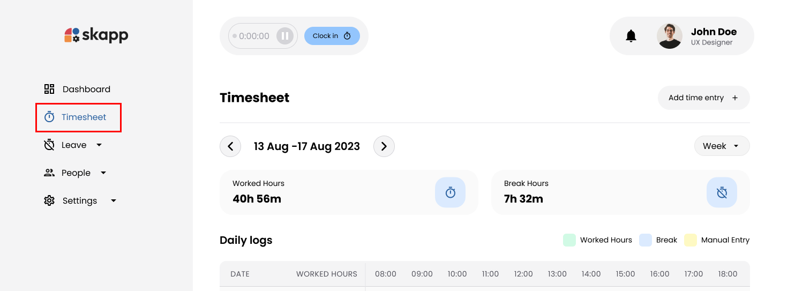
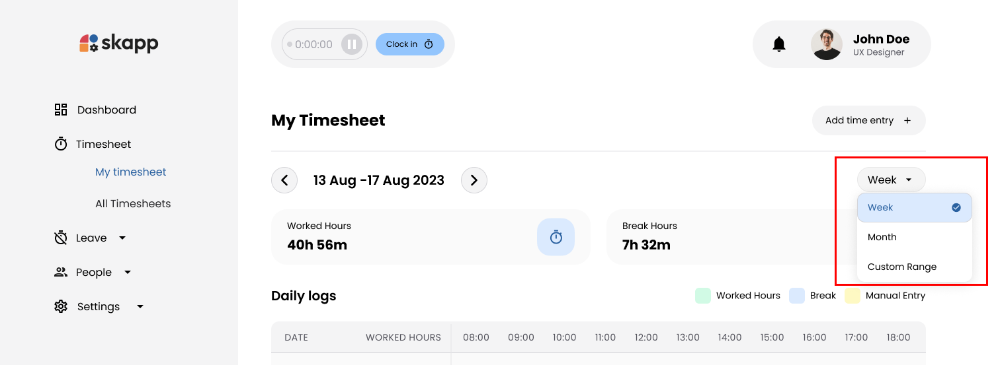
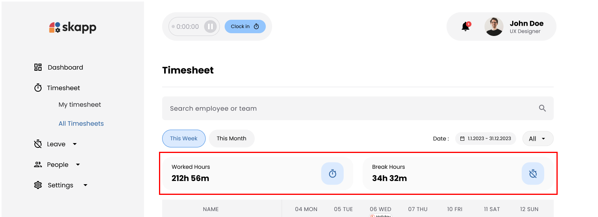
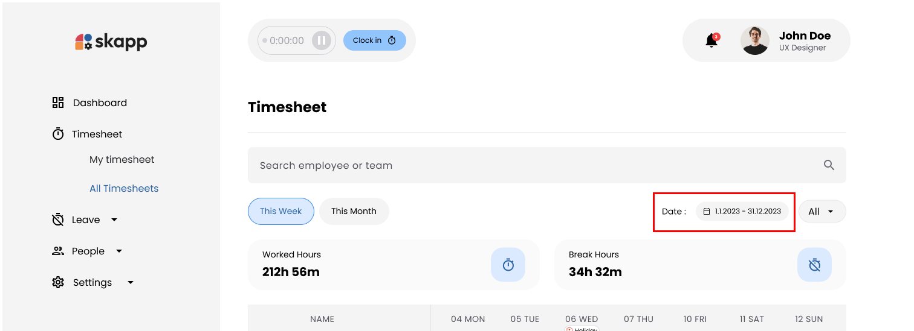
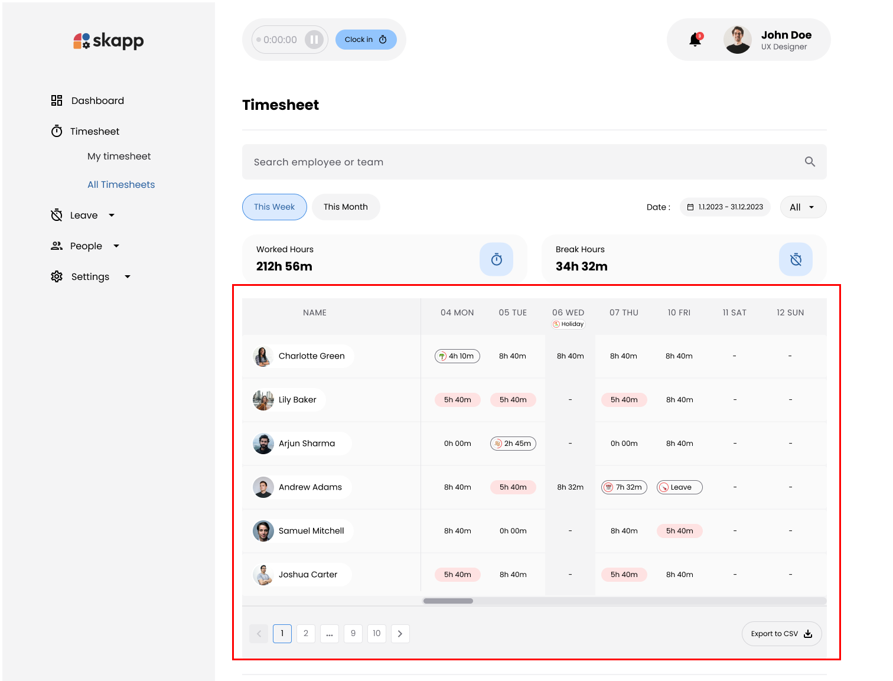
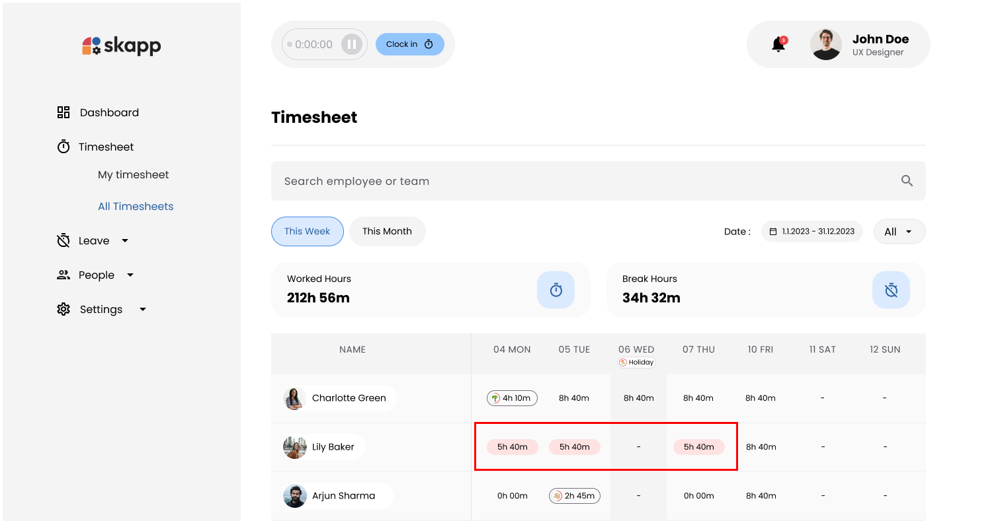
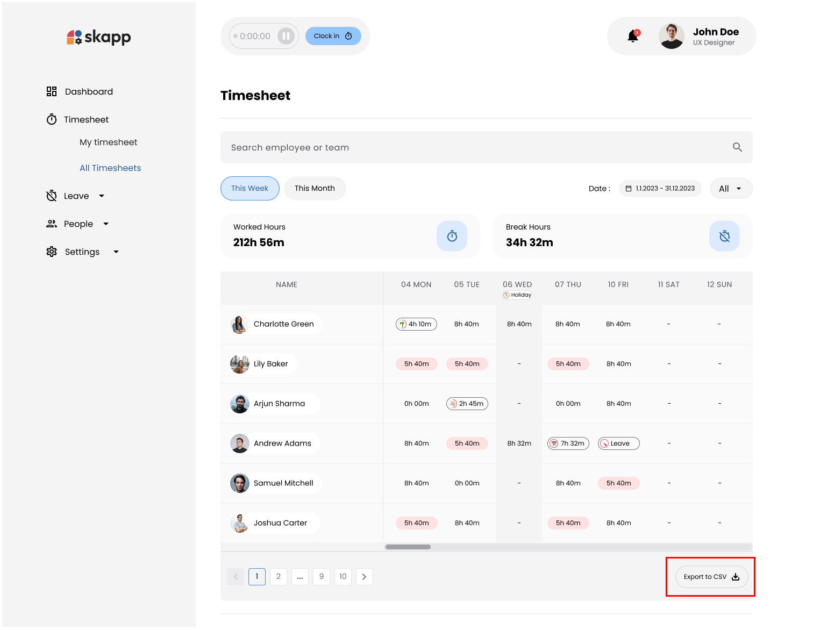

## Introduction

The **Timesheets** feature provides users and administrators with the ability to view and manage work hours over selected periods. It offers a detailed overview of work hours, break hours, and daily activities, facilitating efficient time tracking and attendance management for both individuals and the entire organization.

---

## My Timesheet

**My Timesheet** allows users to view and manage their own logged work hours over a selected period. It provides an overview of work hours, break hours, and daily activities, helping users keep track of their time and attendance records.

### Accessing My Timesheet

**Users with "Employee" user role in the Attendance Module**

- Access **Timesheet** directly from the main navigation bar.

**Users with "Super Admin","Attendance Admin or Attendance Manager" user roles**

1. Navigate to the **Timesheet** submenu in the main navigation bar.
2. Click on **My Timesheet**.

---

### Highlight Cards

At the top of the **My Timesheet** page, highlight cards provide summarized information based on the selected date range:

1. **Total Work Hours**:
   Displays the total hours worked during the selected period, including work hours on working days, non-working days, and leave days.

2. **Break Hours**:
   Shows the total break hours taken during the selected period, including breaks on working days, non-working days, and leave days.

---

### Daily Log

The Daily Log section provides a detailed breakdown of each day's activities within the selected period. This section helps users understand how their time was allocated on a daily basis.

#### Log Entries

- Time entries are displayed for each day, with the latest date at the top (reverse chronological order)
- Each day's entry occupies a distinct row in the log.
  - Date: The specific date of the entry.
  - Total Work Hours: The total hours worked on that day.
  - Activity Bars: A visual timeline representing the user's activities throughout the day.

#### Activity Bars

- The Activity Bars provide a graphical representation of the user's activities during each day. They help visualize how work hours and breaks are distributed over time.
- The activity bar spans from the clock-in time to the clock-out time of the day.
- It is divided into segments based on different activities (e.g., work periods, breaks)
- **Color-coded** to represent different activities:
  - **Worked Hours**: Green
  - **Break Hours**: Blue
  - **Manual Entry**: Yellow

:::info[Special Scenarios]

1. **Leave Days**: If no time was logged due to leave, the entry remains empty, and a **leave icon** indicates whether it was a full-day or half-day leave.

2. **Holidays**: If no time was logged due to a holiday, the entry remains empty, and a **holiday icon** indicates whether it was a full-day or half-day holiday.

3. **No Time Logged**: On regular working days with no time logged, the entry remains empty without special icons.

:::

---

### Filters and Date Selection

Users can adjust the displayed time period using the following filters:

- **Week**
- **Month**
- **Custom Range**

---

## All Timesheets

### Overview

**All Timesheets** allows administrators and managers to view and monitor the work hours of employees across the organization. It provides an overview of attendance records, enabling efficient management of work hours, breaks, and overall attendance.

---

### Accessing All Timesheet

**Accessible for Users with "Super Admin","Attendance Admin or Attendance Manager" user roles only**

1. Navigate to the **Timesheet** submenu in the main navigation bar.
2. Click on **All Timesheets**.

---

### Employee and Team Filters

#### Role-Based Access

1. **Users with Super Admin or Attendance Admin user roles**

   - **All Employees**: User have access to view timesheets for all active employees in the organization.
   - **Teams**: User can select any team within the organization to view timesheet data specific to that team.

2. **Users with Attendance Manager user role**
   - **All Employees**: User can view timesheets for employees they supervise directly. This includes employees for whom they are designated as the Primary Supervisor, Secondary Supervisor, or Team Supervisor.
   - **Teams**: User can select teams that they manage to view timesheet data for employees within those teams.

---

### Highlight Cards

Highlight cards provide summarized information based on the selected filters

1. **Work Hours**: Displays the total work hours for the selected date range, including hours on working days, non-working days, holidays, and leave days for the selected employees.

2. **Break Hours**: Shows the total break hours taken during the selected date range, including breaks on working days, non-working days, holidays, and leave days for the selected employees.

---

### Date Filter

Users can adjust the displayed data using the date filter given

---

### Work Hours Table

The **Work Hours Table** presents detailed daily work hours for each selected employee within the selected date range.

1. **Worked Hours Display**:

   - Shows total hours worked per day for each employee.
   - On leave days or holidays, worked hours are displayed with appropriate indicatator.

2. **Color Indicators**:
   - Insufficient hours are indicated with a red-colored chip.(If actual worked hours are less than the standard worked hours configured by the organization)

---

### Exporting Timesheets

Users can export timesheet data for further analysis or record-keeping.

- Click the **Export CSV** button to download a CSV file containing the timesheet data for the selected date range and filters.

