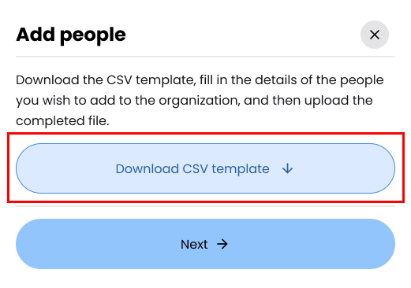
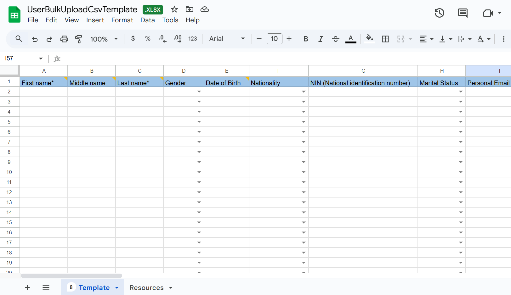
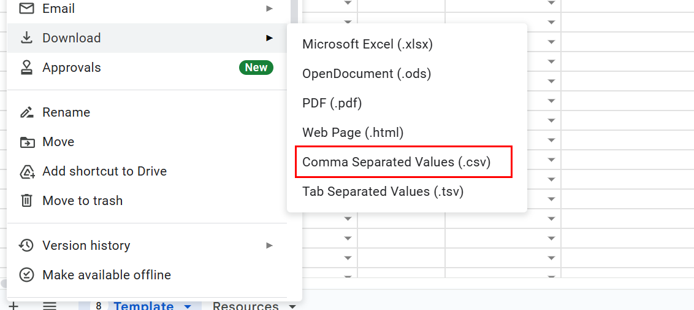
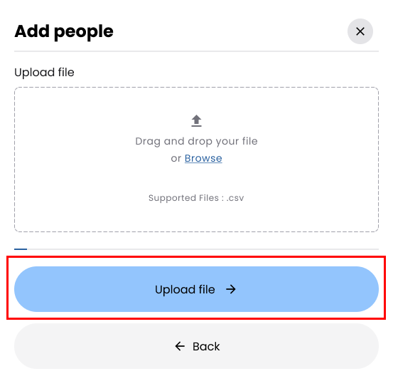

## Introduction

The User Bulk Upload feature in Skapp simplifies the process of adding multiple users to the system at once. By uploading a CSV file, administrators can efficiently populate user data, minimizing manual entry and ensuring consistency. This guide outlines the steps for preparing, uploading, and validating user data to streamline the onboarding process.

---

## Accessing the Bulk Upload

:::info

- Users with the `Super Admin` and `People Admin` roles can bulk upload the users.
- Users with the `People Manager` role can only view the add users through directory.

:::

1. Navigate to the **People** option in the main navigation bar.
2. Click on the **Directory** sub-menu option.

---

## Step 1: Click on the Bulk Upload Button

- Click on the bulk upload button in the directory page.

## Step 2: Downloading the Template

1. In the **Add People Modal**, click the **Download Template** button.

2. Save the template file to your device.
   - The template is provided in **CSV format**.
   - It contains predefined columns to ensure data consistency.
3. Open the file using spreadsheet software (e.g., Excel).

---

## Step 3: Filling Out the Template

1. Enter the required data for each individual, adhering to these guidelines:
   - Fill all **mandatory fields**.
     - First Name
     - Last Name
     - Work email

:::danger[Important]

- To fill out the other details use the **resource tab** given in the template and copy paste the values.
- When assiging teams,job families and titles make sure that you use same naming as in the system.
- When assigning **primary and secondary supervisors** add them through their **work email**.

:::

2. **Save the completed file** in CSV format.

---

## Step 4: Uploading the Completed Template

1. Click the **Next** button in the **Add People Modal**.

2. Drag and drop the completed CSV file into the upload area or click to browse and select the file.

---

## Step 5: File Validation

The system validates the uploaded file against the following rules:

:::warning[File Requirment]

- **File format**: Only **CSV format** is accepted.
- **File Size**: Files larger than **5MB** are not accepted.
- **Template Structure**: The uploaded file must match the downloaded template structure, including correct column headings.

:::

---

## Step 6: Review and Resolve Errors

If errors occur during the upload process:

- An **Error Log (CSV)** is available for download:
- Download the error log.
- Open the downloaded **Error Log CSV** for detailed error descriptions.
- Update the original CSV file based on the errors in the log.
- Re-upload the corrected file.
